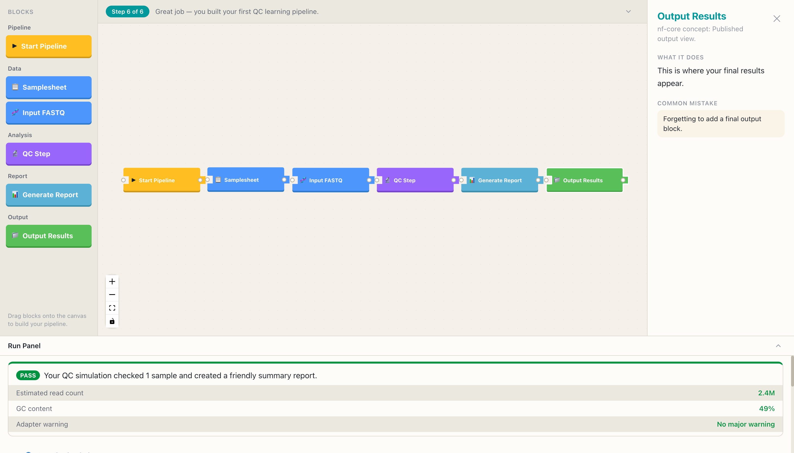

<div align="center">


<br />
<br />

<!--  -->

<h1>BioFlow Blocks</h1>

<p>
  <strong>A visual learning playground for Nextflow and nf-core pipeline concepts.</strong><br />
  Build bioinformatics workflows with blocks — before you ever touch a terminal.
</p>

<br />

<!-- Badges -->
<p>
  
  
  
  
  
  
</p>

<p>
  
  
  
  
</p>

</div>

---

## What is BioFlow Blocks?

BioFlow Blocks is a **Scratch-inspired visual simulator** that teaches beginners how Nextflow and nf-core bioinformatics pipelines work — without requiring any command-line experience.

Learners drag colorful blocks onto a canvas, connect them into a pipeline, and click **Simulate** to see a friendly step-by-step trace and a mock QC report. Every block maps to a real nf-core concept (samplesheets, modules, processes, outputs), and each interaction is explained in plain language first, with the technical detail available on demand.

> **"Build and understand your first bioinformatics pipeline visually — before touching the terminal."**

---

## Demo

<div align="center">
  
  <p><em>A completed RNA-seq QC pipeline: blocks connected on the canvas, block inspector open on the right, QC report card and trace in the run panel below.</em></p>
</div>

---

## Who is it for?

| Persona | Context |
|---|---|
| **Bioinformatics students** | Need to understand nf-core pipelines for coursework or thesis |
| **Wet-lab researchers** | Want to know what happens to their sequencing files |
| **Workshop instructors** | Need an interactive teaching tool for 60–90 minute sessions |
| **Junior bioinformaticians** | Know commands but not the underlying structure |

---

## Features (Phase 0–8 complete)

- **Visual pipeline canvas** — Scratch-style puzzle-connector blocks, drag-and-drop, React Flow DAG
- **45 blocks across 7 nf-core packs** — from nf-core/rnaseq to nf-core/sarek, nf-core/scrnaseq, and more
- **Connection validation** — incompatible connections rejected with a beginner-friendly toast
- **Mock simulation engine** — pure, deterministic, client-side; trace + QC report in under 3 seconds
- **Block inspector** — beginner explanation + nf-core module name always visible side by side
- **6 new pipeline packs** (Phase 8) — nf-core/chipseq (epigenomics, 7 blocks), nf-core/fetchngs (data download, 4 blocks), nf-core/ampliseq (16S/ITS amplicon, 6 blocks), nf-core/methylseq (bisulfite sequencing, 4 blocks), nf-core/differentialabundance (DE analysis, 7 blocks), nf-core/spatialvi (Visium spatial transcriptomics, 7 blocks); 35 new blocks; 2 new missions (⬇️ Data Downloader, 🧲 Peak Caller); 181 tests passing
- **Troubleshoot page** (`/troubleshoot`) — Phase 7: 10 common nf-core errors with exit codes, root causes, and step-by-step fixes; interactive `nextflow log` table with column/row explanations; pipeline versioning (`-r` flag) interactive builder; institutional config profiles (UPPMAX, AWS Batch, GCP, generic SLURM)
- **DSL2 Code Bridge** (`/dsl2`) — Phase 6: annotated Nextflow DSL2 code generated from the visual pipeline; meta map `[meta, file]` visualizer; 5 channel operator diagrams (map, groupTuple, combine, branch, collect); interactive work directory explorer with file contents; `-resume` simulator showing cached vs re-run steps; `nextflow.config` annotated structure
- **Pack pages** (`/packs`, `/packs/[id]`) — Phase 5: dedicated learning hub per nf-core pipeline with pipeline info, key modules, test command, block catalog, and missions
- **6 learning missions** — Missions 5 (nf-core/sarek) and 6 (nf-core/taxprofiler) added; all pack cards link to their pack page
- **Test Run page** (`/test-run`) — Phase 4: real nf-core/rnaseq test dataset (GSE110004, S. cerevisiae, 6 samples, ~2 MB FASTQs), simulated execution with realistic Nextflow trace, per-sample QC stats, and interactive output directory explorer
- **Command Bridge** — interactive dissector: click any part of the `nextflow run` command to get a plain-language explanation, nf-core docs link, and real-world examples
- **Profile selector** — choose docker/singularity/conda/test with explanations; updates the full command instantly
- **Params JSON preview** — see the `params.json` file that maps to your pipeline choices, with copy button
- **Command Anatomy** — visual breakdown on the landing page showing every flag in the nf-core command
- **Project save/load** — save pipelines to localStorage, load/duplicate/delete from the Projects panel in builder
- **Editable samplesheet** — click the Samplesheet block to open a live-validated table with per-cell error hints
- **Module registry** — searchable `/modules` page showing all 45 blocks with nf-core docs, filterable by pack and status
- **3 guided missions** — Build QC Pipeline · Add Trimming · Generate the nf-core Command
- **Mission map** — visual gallery at `/missions` showing locked/available/completed states
- **Completion badges** — earned on mission completion with a reflection question and "Next Mission" CTA
- **Mission persistence** — progress saved to localStorage across sessions
- **Tutorial wizard** — 6-step guided tour on first visit
- **Demo run preview** — completed simulation shown immediately on first load
- **Light/dark theme** — toggle in nav, persisted to localStorage, no flash on reload
- **Workflow JSON viewer** — see the internal pipeline IR your blocks compile to
- **No installation required** — runs entirely in the browser; no backend, no auth, no database

---

## Getting Started

### Prerequisites

- Node.js 20 LTS or later
- npm 10+

### Run locally

```bash
git clone git@github.com:a-lamloum/bioflow-blocks.git
cd bioflow-blocks
npm install
npm run dev
```

Open [http://localhost:3000](http://localhost:3000) in your browser.

### Try the missions

Go to [http://localhost:3000/missions](http://localhost:3000/missions) to see the mission map, then:

1. **Mission 1** — Build Your First QC Pipeline: drag 6 nf-core/rnaseq blocks, connect, simulate
2. **Mission 2** — Add Trimming: add TrimGalore alongside FASTQC, see both in the report
3. **Mission 3** — Generate the Command: add a profile and parameter block, inspect the `nextflow run` output

Each mission earns a badge and shows a reflection question to reinforce the nf-core concept.

### Other commands

```bash
npm run test       # 33 unit + component tests (Vitest)
npm run typecheck  # TypeScript strict check
npm run lint       # ESLint
```

---

## Tech Stack

| Layer | Technology |
|---|---|
| Framework | Next.js 16 — App Router, Client Components |
| Language | TypeScript 5 — `strict: true` throughout |
| Canvas | `@xyflow/react` (React Flow v12) — DAG pipeline visualization |
| Styling | Tailwind CSS v4 — CSS-native `@theme` token system |
| Design system | OKLCH color palette, Inter + JetBrains Mono via `next/font` |
| Simulation | Pure TypeScript — deterministic, synchronous, zero I/O |
| Testing | Vitest + React Testing Library |

---

## Project Structure

```
src/
├── app/                      # Next.js App Router
│   ├── page.tsx              # Main builder page (Client Component)
│   ├── layout.tsx            # Root layout with fonts
│   └── globals.css           # Tailwind v4 @theme + design tokens
├── components/
│   ├── canvas/               # React Flow canvas, custom nodes, edges
│   ├── blocks/               # Block library panel + draggable cards
│   ├── inspector/            # Block inspector slide-over
│   ├── mission/              # Mission strip + floating guide card
│   ├── run/                  # Run panel, trace list, QC report card
│   └── ui/                   # Button, Badge, Card, Toast primitives
├── lib/
│   ├── blocks/definitions.ts # All 7 BlockDefinition objects + compatibility matrix
│   ├── compiler/compile.ts   # compile() + topologicalSort() — pure functions
│   ├── validator/validate.ts # validate() — 6 error codes, beginner messages
│   ├── simulator/simulate.ts # simulate() — deterministic mock execution
│   └── mission/missions.ts   # Mission data + completion logic
├── types/index.ts            # All shared TypeScript interfaces
└── data/demo-samplesheet.ts  # Static demo sample rows

specs/001-phase0-rnaseq-playground/
├── spec.md                   # Feature specification
├── plan.md                   # Implementation plan
├── research.md               # Technical decision log
├── data-model.md             # Entity reference
├── contracts/                # Pure-function interface contracts
├── quickstart.md             # Dev setup + exit checklist
└── tasks.md                  # 43 tasks (all completed)
```

---

## Architecture Principles

BioFlow Blocks follows a strict **separation of concerns** mandated by the [project constitution](.specify/memory/constitution.md):

```
UI layer          ← React components, canvas, panels
Block schema      ← TypeScript definitions, compatibility matrix
Simulator layer   ← Pure functions: compile → validate → simulate
Execution layer   ← (Phase 4+) sandboxed worker, not yet wired
```

The `lib/` modules have **zero React imports** — they are plain TypeScript functions that can be tested without mounting any component. All UI logic lives in `components/`; all business logic lives in `lib/`.

---

## Concept Mapping

Every block in BioFlow Blocks maps to a real nf-core or Nextflow concept:

| Block | Beginner label | nf-core concept |
|---|---|---|
| Start Pipeline | Where your pipeline begins | Workflow entry point |
| Samplesheet | Your sample list | `params.input` / CSV samplesheet |
| Input FASTQ | Raw sequencing files | FASTQ input channel, paired-end reads |
| QC Step | Read quality check | Process / Module concept (e.g. FastQC) |
| Trim Reads | Read cleaning | Preprocessing module (e.g. fastp) |
| Generate Report | Summary report | MultiQC-like aggregation step |
| Output Results | Where your results appear | `publishDir` / output directory |

---

## Roadmap

| Phase | Status | Description |
|---|---|---|
| **Phase 0** | ✅ Complete | Visual prototype — 7 blocks, canvas, mock simulation, first mission |
| **Phase 1** | ✅ Complete | Project save/load (localStorage), editable samplesheet validator, module registry at `/modules` |
| **Phase 2** | ✅ Complete | Mission map, 3 missions, completion badges, reflection questions, dark mode, 45-block library |
| **Phase 3** | ✅ Complete | Command Bridge — interactive command dissector, profile selector, params JSON preview, docs integration |
| **Phase 4** | ✅ Complete | Tiny test-data execution — real nf-core/rnaseq test dataset (GSE110004, S. cerevisiae), realistic trace, QC stats, output explorer at `/test-run` |
| **Phase 5** | ✅ Complete | nf-core concept packs — dedicated pack pages, 6 missions (incl. nf-core/sarek + nf-core/taxprofiler), pack explorer at `/packs` |
| **Phase 6** | ✅ Complete | **Nextflow DSL2 Code Bridge** — show the real Nextflow code (`process {}`, `workflow {}`) behind each visual block; meta map `[meta, file]` convention; channel operators (`map`, `groupTuple`, `combine`); work directory concept; `-resume` flag; aligned with [training.nextflow.io](https://training.nextflow.io/latest/) Tracks 1–2 |
| **Phase 7** | ✅ Complete | **Execution, Resume & Troubleshooting** — exit code decoder, work directory explorer, resume simulator, `nextflow log` viewer, institutional configs, pipeline versioning (`-r`); aligned with the official *Troubleshooting* side quest |
| **Phase 8** | ✅ Complete | **Extended Pipeline Packs** — nf-core/chipseq (epigenomics), nf-core/fetchngs (SRA/GEO download), nf-core/ampliseq (16S amplicon), nf-core/methylseq, nf-core/differentialabundance, nf-core/spatialvi (spatial transcriptomics); covering more of the [149 nf-core pipelines](https://nf-co.re/pipelines) |
| **Phase 9** | 🔜 Planned | **nf-core Developer Track** — module anatomy (`main.nf`, `meta.yml`, `environment.yml`, `tests/`), nf-test framework, Biocontainers browser, PR checklist, `nf-core create` template wizard; aligned with the official [*Hello nf-core* course](https://training.nextflow.io/latest/) (5 parts) |
| **Phase 10** | 🔜 Planned | **Seqera Platform Bridge** — launch pipelines from Seqera Platform (Tower), compute environments (AWS Batch, GCP, Azure, SLURM), workspaces, datasets, and run monitoring |

### Coverage gap analysis

A comparison of BioFlow Blocks against [training.nextflow.io](https://training.nextflow.io/latest/) and [nf-co.re](https://nf-co.re) identified the following gaps driving Phases 6–10:

| Gap | Priority | Target phase |
|---|---|---|
| Nextflow DSL2 language (channels, processes, workflows, config) | 🔴 High | Phase 6 |
| `-resume`, work directory, exit codes, troubleshooting | 🔴 High | Phase 7 |
| Missing pipeline categories (epigenomics, amplicon, spatial, proteomics) | 🟡 Medium | Phase 8 |
| nf-core module writing, nf-test, meta.yml, Biocontainers | 🟡 Medium | Phase 9 |
| Seqera Platform / Tower integration | 🟢 Low | Phase 10 |

The biggest single gap: the official training teaches *how Nextflow works* (DSL2 language, channels, the work directory, resume). BioFlow currently teaches *which nf-core pipelines exist* and how to run them. Phase 6 closes that core gap.

---

## Educational Disclaimer

BioFlow Blocks is a **learning simulator**. No real Nextflow pipelines are executed. All simulation output is deterministic and educational — it is not scientifically valid data. When execution is introduced in a later phase, it will use curated tiny test datasets in a controlled sandbox environment only.

This project is not an official nf-core product. It is a learning tool built *using* nf-core concepts and documentation.

---

## License

This project is released under a **MIT-based Non-Commercial License**.

Free to use for personal, academic, educational, and open-source purposes.
**Commercial use requires explicit written permission from the author.**

> Commercial use includes — but is not limited to — selling, licensing, offering
> as a paid service, integrating into a commercial product, or using in any
> revenue-generating context.

See the full [LICENSE](LICENSE) file for details.

---

<div align="center">

Built with care for bioinformatics beginners everywhere. 🧬

<sub>Powered by <a href="https://nextflow.io">Nextflow</a> concepts · Aligned with <a href="https://nf-co.re">nf-core</a> documentation</sub>

<br />

<sub>© 2026 Ahmed Lamloum — Commercial use by author permission only.</sub>

</div>
